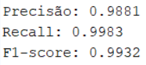
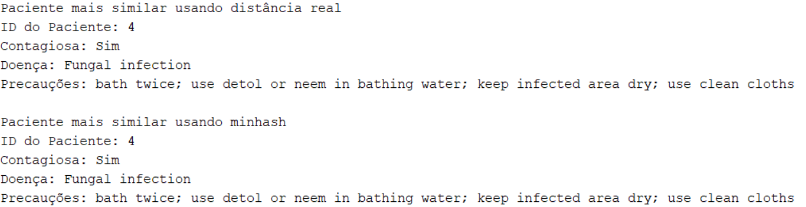
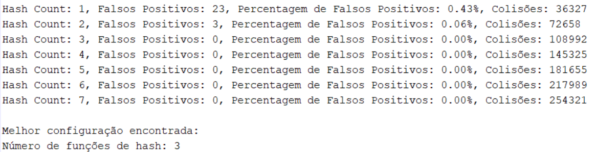

# 🩺 Check-up de Saúde Inteligente

This project was developed as part of the MPEI course unit.

**Grade: 17/20 (2nd best in class)**
---

## Authors
- João Pinho — Student ID: 113602
- Orlando Marinheiro — Student ID: 114060
---

## Objective

The goal of this project is to help users assess their health based on reported symptoms, by providing indications on whether their symptoms may correspond to a contagious disease, along with safety precautions and insights from similar diagnosed cases.

---

## Application Overview

The application offers several intelligent features aimed at health awareness and disease prevention:

- **Contagion Classification**: Determines whether the given symptoms are associated with a contagious disease.
- **Suspicion Validation**: Allows users to enter a suspected disease and checks whether their symptoms match.
- **Most Similar Patient Finder**: Returns the most similar diagnosed patient based on symptoms, including:
  - Patient ID
  - Whether the disease is contagious
  - Disease name
  - Suggested precautions

---

## Algorithms Used

### Naïve Bayes Classifier

Used to classify whether a disease is contagious based on the symptoms provided.

**Test Results:**

---

### MinHash

Used to find the most similar patient previously diagnosed, based on Jaccard similarity. Offers high performance with results comparable to real vector distance.

### Bloom Filter
Used to verify if a user's symptoms match a suspected disease, helping either reassure or alert the user to potential risks.

**Best configuration found**: 3 hash functions (0% false positives with reasonable collision rate)

---

## How to Test the App

- Run the **`main.m`** file in MATLAB to launch the application interface.
- To view the algorithm test results, run the **`test.m`** file in MATLAB.
---

## Demo
[Demo MPEI project - Check-up de Saúde Inteligente](https://youtu.be/AE_Vo8fMrgM)
